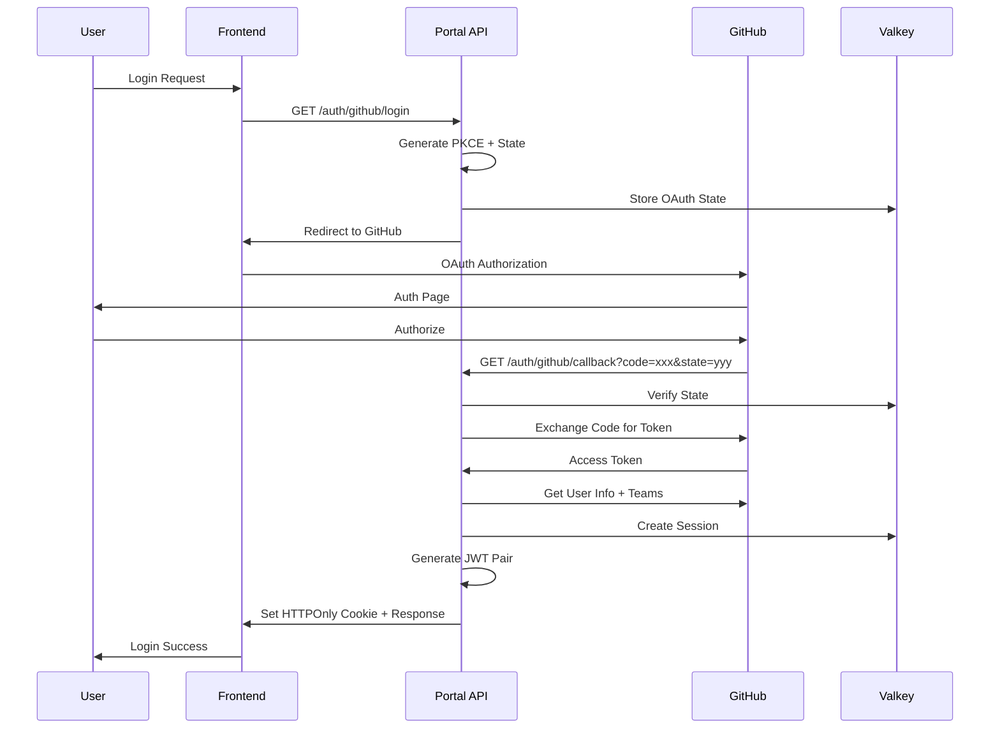
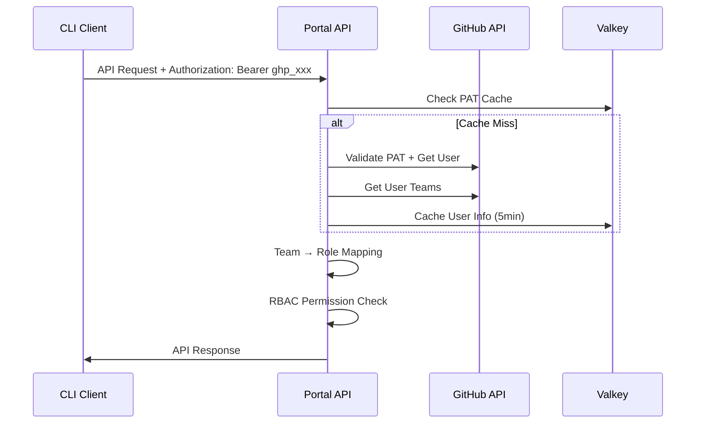
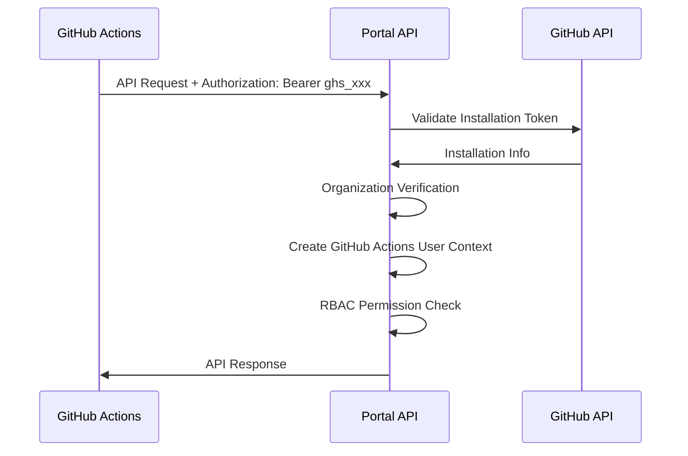

# Portal API 認証・認可システム実装概要

## アーキテクチャ

```
┌─────────────────┐    ┌─────────────────┐    ┌─────────────────┐
│   Frontend App  │    │   CLI Client    │    │ GitHub Actions  │
│                 │    │                 │    │                 │
│ OAuth + Cookie  │    │ PAT + Header    │    │ Install Token   │
└─────────────────┘    └─────────────────┘    └─────────────────┘
         │                       │                       │
         │              ┌────────┴────────┐             │
         │              │ Authorization:  │             │
         │              │ Bearer <token>  │             │
         │              └─────────────────┘             │
         │                                               │
         └─────────────────────┬─────────────────────────┘
                               │
                ┌──────────────▼──────────────┐
                │      Portal API Server      │
                │                             │
                │ ┌─────────────────────────┐ │
                │ │  Auth Middleware        │ │
                │ │  ├─ JWT Validation      │ │
                │ │  ├─ PAT Validation      │ │
                │ │  ├─ Install Validation  │ │
                │ │  └─ Session Management  │ │
                │ └─────────────────────────┘ │
                │                             │
                │ ┌─────────────────────────┐ │
                │ │  RBAC Middleware        │ │
                │ │  ├─ Team-based Roles    │ │
                │ │  ├─ Permission Check    │ │
                │ │  └─ Resource Access     │ │
                │ └─────────────────────────┘ │
                │                             │
                │ ┌─────────────────────────┐ │
                │ │  API Endpoints          │ │
                │ │  ├─ /v1alpha1/*         │ │
                │ │  ├─ /auth/*             │ │
                │ │  └─ /health/*           │ │
                │ └─────────────────────────┘ │
                └─────────────────────────────┘
                               │
        ┌──────────────────────┼──────────────────────┐
        │                      │                      │
   ┌────▼────┐          ┌─────▼─────┐          ┌─────▼─────┐
   │ Valkey  │          │  GitHub   │          │Kubernetes │
   │(Session)│          │    API    │          │  Cluster  │
   └─────────┘          └───────────┘          └───────────┘
```

## 実装されたコンポーネント

### 1. 認証ライブラリ (`pkg/auth/`)

#### JWT管理 (`jwt.go`)
- RSA256署名によるJWT生成・検証
- Access Token (1時間) + Refresh Token (8時間)
- セッションIDによる失効管理

#### セッション管理 (`session/`)
- Valkeyベースの高速セッションストレージ
- セッション作成、取得、更新、削除
- ユーザーTeam情報キャッシュ（5分間）

#### GitHub認証 (`github/`)
- **OAuth フロー** (`oauth.go`): PKCE対応、state検証、CSRF保護
- **PAT認証** (`pat.go`): スコープ検証、キャッシュ機能
- **Installation Token認証** (`installation.go`): GitHub Actions用

### 2. ミドルウェア (`pkg/auth/middleware/`)

#### 認証ミドルウェア (`auth.go`)
- 統合認証処理（JWT/PAT/Installation Token）
- リクエストコンテキストへの認証情報設定
- 必須認証・オプション認証の両方をサポート

#### CSRF保護 (`csrf.go`)
- OAuth認証用のCSRF攻撃対策
- セッションベースのトークン管理
- 状態ありリクエスト（POST/PUT/DELETE）を保護

#### レート制限 (`ratelimit.go`)
- IP単位・ユーザー単位の多段階制限
- Token bucket algorithm使用
- 認証状態に応じた制限値調整

#### 監査ログ (`audit.go`)
- 全API呼び出しの構造化ログ記録
- 認証情報、リクエスト詳細、レスポンス時間
- セキュリティイベント追跡

#### RBAC (`rbac.go`)
- 権限ベースのアクセス制御
- GitHub Team連携
- 細粒度リソース保護

### 3. ロールベースアクセス制御 (`pkg/rbac/`)

#### 権限定義 (`permissions.go`)
- 7つの権限タイプ（applications:read/write, secrets:read/write, system:admin, audit:read, metrics:read）
- 権限グループによる効率的管理
- 検証機能内蔵

#### ロール管理 (`roles.go`)
- GitHub Team → ロールマッピング
- 階層的権限継承
- 複数Team権限結合

#### 権限評価 (`evaluator.go`)
- リアルタイム権限チェック
- バッチ権限検証
- エラーハンドリング（strict/permissive mode）

### 4. 設定システム拡張

既存の`pkg/config/`を拡張して認証関連設定を追加：

```go
type Config struct {
    Auth AuthConfig `yaml:"auth"`
    // ... 既存フィールド
}

type AuthConfig struct {
    GitHub GitHubConfig `yaml:"github"`
    JWT    JWTConfig    `yaml:"jwt"`
    Valkey ValkeyConfig `yaml:"valkey"`
}
```

## 認証フロー詳細

### 1. OAuth認証フロー



### 2. PAT認証フロー



### 3. Installation Token認証フロー



## セキュリティ設計

### 1. 多層防御
- **認証層**: JWT署名検証 + GitHub API検証
- **認可層**: Team-based RBAC + 細粒度権限
- **セッション層**: Valkey TTL + 失効管理
- **通信層**: HTTPS必須 + CSRFトークン

### 2. トークン管理
- **JWT**: RS256署名、短期間有効、ステートレス
- **Session**: Valkey保存、長期間有効、失効可能
- **GitHub Token**: API制限レート対応キャッシュ

### 3. 攻撃対策
- **CSRF**: Double Submit Cookie Pattern
- **Session Fixation**: セッションID再生成
- **Token Hijacking**: HTTPOnly Cookie + Secure Flag
- **Brute Force**: IP/ユーザーレート制限

## パフォーマンス特性

### 1. JWT検証
- **CPU**: RSA256検証（高速）
- **Memory**: クレーム解析（最小限）
- **Network**: ネットワーク不要（ステートレス）

### 2. PAT認証
- **Cache Hit**: ~1ms（Valkeyアクセス）
- **Cache Miss**: ~100-500ms（GitHub API）
- **Cache Duration**: 5分間

### 3. セッション管理
- **Read**: ~1ms（Valkeyアクセス）
- **Write**: ~2ms（Valkeyアクセス）
- **TTL**: 自動期限管理

## 監視・運用

### 1. ログ出力
- **認証イベント**: 成功/失敗/エラー
- **認可イベント**: 権限チェック結果
- **API監査**: 全リクエスト詳細
- **セッション**: 作成/更新/削除

### 2. メトリクス（実装予定）
- 認証成功率・失敗率
- GitHub API呼び出し回数・レート制限
- セッション数・有効期限統計
- レスポンス時間分布

### 3. アラート（実装予定）
- 異常な認証失敗率
- GitHub API制限到達
- Valkey接続エラー
- 権限昇格試行

## 今後の拡張予定

1. **多要素認証 (MFA)**: TOTP/SMS対応
2. **監査ログ強化**: 構造化ログ出力
3. **メトリクス**: Prometheus/Grafana連携
4. **キャッシュ最適化**: 分散キャッシュ対応
5. **負荷分散**: 複数インスタンス対応